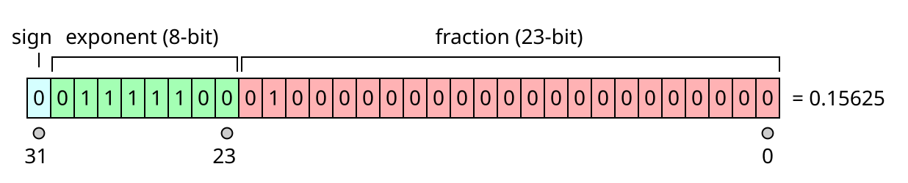

+++
title = "IEEE754 学习"
author = ["liming fang"]
tags = ["basic"]
categories = ["cs"]
draft = false
+++

## TODO {#todo}

排版用 latex 调整下。

## Intro {#intro}

写这篇 blog 目的是了解一下浮点数规范，并尝试分析一些设计背后的原因（简单的）。主要参考了 IEEE754-1985。

## basic {#basic}

浮点数包括 16-bit(half precision)、32-bit(single precision)、64-bit(double precision)、128-bit(quadruple precision)，其表示范围和精度不同，但是格式是一致的。
首先参考十进制科学计数法：
number = base10 \* 10exp, 1&lt;=base&lt;10

IEEE754 规范采用了类似的思路，只不过 base, exp 这些都使用二进制表示。举个例子：

-   1.25 = 1.25 \* 2^0 = 1.01_2 \* 2^0
-   0.625 = 1.25 \* 2-1 = 1.01_2 \* 2-1

上面这种是 normalized numbers，即 base 是 1.x 的形式，IEEE754 还规定了 denormalized numbers，目的是表示 (-1,1) 区间内非常非常小的数字。后边章节介绍存储时如何区分这两种类型（当然还有一些其他特殊的 number，但都是个例，后边一并介绍）。

## More Detail {#more-detail}

以上例子介绍了一个浮点数由哪几部分组合表达，现在介绍更具体的存储格式。显然有如下几部分需要表示：

-   符号位
-   base
-   exponent

以 FP32 为例，IEEE754 将32个 bits 如下划分：

### 符号位 {#符号位}

1-bit，非常简单，跳过。唯一需要注意的是对于浮点数能表示的数字正负是对称的。

### exp &amp; fraction {#exp-and-fraction}

以 FP32 为例，指数部分 8-bit 能表示 [0,255]，具体分三种情况：

1.  全0：对应0
2.  全1：对应 255
3.  其他：[1,254]

其中，exp 部分不同的类别会影响 fraction 部分的解释。

对于 case3, fraction 部分按照 1.x 形式解析（即 normalized），例如 `01000..000` 等于1.25。此时对于指数部分显然需要正负都有覆盖（全是正数的话，只能表示大于 base 的数了，不合理），因此 IEEE754 adds a bias to the exponent，即真正的指数部分需要在 8-bit 对应的数基础上减去 127，因此范围是 [-126,127]，因此 normalized number 可表示的正数范围是：

-   min: 1 \* 2-126 -&gt; 10-38
-   max: (1+1-2-23) \* 2127 -&gt; 1038

对于 case1, fraction 部分按照 0.x 形式解析（即 denormalized），例如 `01000..000` 等于 0.25。此时指数部分全是0，显然我们也需要给它加一个 bias，多少呢？主要基于如下考虑：

-   denormalized number 和 normalized number 不应该有重叠，且前者更小。显然 bias=-126.

此时可表示的正数范围是：

-   min: 2-23 \* 2-126 -&gt; 10-45
-   max: (1-2-23) \* 2-126 -&gt; 1038

截至目前，正常数字表示需求已经都满足了，IEEE754 还提供两种表示含义：

1.  not a number：例如对负数开平方
    case2 + fraction 部分任选，但不能全0
2.  无穷大（不过不太理解为什么会有这种需求，整型就没有）
    case2 + fraction 全0

### 精度 {#精度}

“表示精度”即我们想要表达的数字和实际存储对应的数字之间误差多大，平时十进制描述的小数也有精度概念，例如如果小数位数最多23位的话，表示 1.1\*10-24 就有误差。基于二进制的浮点数也是类似的，它更进一步，在表示范围内，对于绝大部分数字，都不能将其精确表达。
以 FP32 为例，举一个 normalized 例子：精度可以做到 2-23，大约 10-7

-   expected: 1.1
-   real: 1.1 = 0b00011001100110011001100+ rem, rem&lt;2-23.

但是这并不表示对于任何表示范围内的数字，精度都是 10-7，因为上边例子指数部分是0：当数字变大的时候，fraction 本身的精度会被指数的放大所损毁。

### 一些常见的浮点数 {#一些常见的浮点数}

TBD
