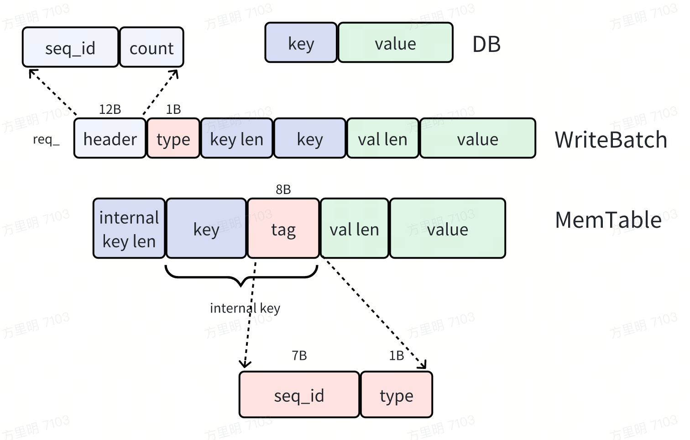
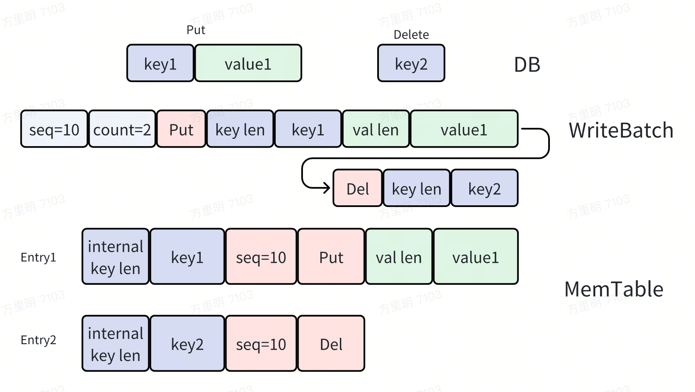
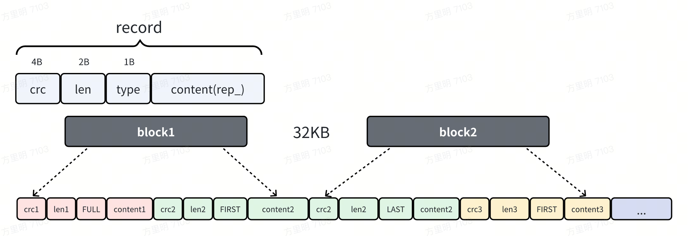
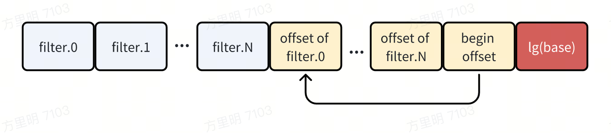

+++
date = '2025-05-18T11:24:36+08:00'
draft = false
title = 'LevelDB Layout'
tags = ['storage', 'cpp']
categories = ['leveldb']
+++

## 1. layout(memtable, sstable,  log)
leveldb 中有一些的 layout 设计点，如果能理解这些设计，对后续流程以及整体的理解会有帮助。  
Layout 贯穿 DB、WriteBatch、MemTable、Log。  
> 本章节尽量不考虑控制流程，聚焦于 layout
### 1.1. memtable

1. 最上层有两种可能：提供 key-value pair `PII` 表示插入/修改，或者只提供 key 表示删除。
2. 中间层是 `WriteBatch`：
   由于 leveldb 中所有 mutation 都以 record 方式记录，所以 `WriteBatch` 中需要能同时描述 key 的插入和删除。而且 `WriteBatch` 还得同时 handle 多条 record
   - header: 记录有多少笔 `PII` 以及它们共享的 `seq_id`。
   - type: 标识是 `Put` 还是 `Delete` 操作
   - (key, keylen), (val, val len): 基于 variant length 编码，本质就是 slice
   这一整段连续内存由 `rep_` 表示，后续要直接写到 LOG 中，恢复时会复用 `rep_` 处理流程。所以像 seq_id 等信息都要记录全。
3. 最下层是 MemTable：它负责对所有 record 排序
   - InternalKey：在 user key 基础上引入 seq_id+tag type，这样可以对同一个 key 不同版本排出顺序。
   - 需要注意的，同一个 `WriteBatch` 内 seq_id 是相同的，因此同一个 key 得看操作的先后顺序，越靠后的操作越新。

### 1.2. block-based storage
SSTable 和 Log File 物理存储都按照 block 进行划分，block 中的数据在逻辑层有不同的含义，在各自章节会介绍。

### 1.3. log
WAL 目的是保证异常情况下的数据可靠性，leveldb 需要通过 WAL 恢复出没来得及落盘的 key-value pair，因此 WAL 核心是存储 key-value pair，其他字段/设计都是为了更好的读写（例如性能？）  
log file 在逻辑层按照 record 划分，每个 record 中存放 `WriteBatch` 中的 `rep_` 来间接存放 key-value pair，同时由于变长所以还要存放 len，以及 crc 用于校验。  
`type` 字段和 log file 物理存储格式有关：整个文件默认按照 32KB 划分成多个 block，record 和 block 的关系是：
1. FULL：完全落在单个 block 中
2. FIRST/LAST/MIDDLE：对应横跨多个 block 的 record 不同部分
   
> content 中存放是 `WriteBatch` 中的 `rep_`，这样可以直接复用已有的很多流程。

### 1.4. sstable
memtable 在达到一定容量后会通过 minor compaction 转化成 L0 的 sstable，高层 sstable 也会通过后台 major compaction 转化成低层的 sstable。sstable 目的也是存放 key-value pair。每个 sstable 对应一个操作系统文件。

sstable 物理存储颗粒度是 block，逻辑上划分成：data block、meta block、meta index block、index block、footer。
- data block：显然 sstable 是要存储 key-value 数据的
- meta block：一级元数据，目前仅实现了 filter block（布隆过滤器），目的是加速 sstable 读取
- meta index block：二级元数据，记录 meta block 信息
- index block：二级元数据，记录 data block 信息
- footer：身份标识+ index of meta_index/index block

#### 1.4.1. data block
data block record format 和 WAL record 略有差别：
   
> prefix compression
#### 1.4.2. meta block
数据部分由 filter 构成，每个 filter 对应一个 data range，用于判断某个 key-valud pair 是否在这个 data range 中；元数据部分就是 filter 的 offset，然后最后再加一个 begin offset 和一个 lg(base).
   
